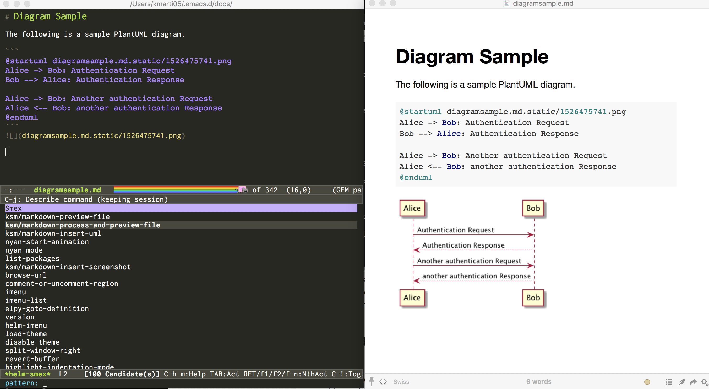

# kmartino-emacs-config

This is a very simple emacs configuration that uses the Emacs Starter Kit, found here:

https://github.com/technomancy/emacs-starter-kit

WARNING: I DO NOT RECOMMEND you use kmartino-emacs-config!

If you are creating a new emacs configuration, I recommend creating a
fresh .emacs.d directory, and init.el file, and follow the
instructions provided by emacs-starter-kit.  Feel free to look at my
configuration here as a guide, but it is not intended for general use.

### Additions to the default emacs-starter-kit

The init.el is written to download a small set of packages I prefer to
run and includes a few modifications to make it easy to get started:

1. Diagram with PlantUML in Markdown.

2. Easy extension! Add a file prefixed with `init-` in the start up
   directory and it will evaluate during startup.
3. Extends the path Emacs uses to find external executables on your
   system based upon your `PATH`
4. Provides a default look and feel that is preferable to the out of
   the box Emacs experience, IMHO.
5. A configuration for Helm and Projectile that makes it easier to
   navigate large projects.
6. Encrypts/Decrypts files with a `.gpg` extension, prompting for a
   password.

### Instructions

This has been tested/ran with the following Emacs version

`GNU Emacs 26.1 (build 1, x86_64-apple-darwin14.5.0, NS appkit-1348.17 Version 10.10.5 (Build 14F2511)) of 2018-05-30`

As of this writing, it is the latest Emacs release. 

Give or take a little Homebrew cleanup, you can install it with the following:

`brew cask install emacs`

(Last warning: I hope you read the warning above - that this is not for general use!)

Check out the project to a folder and then link it to `~/.emacs.d`.

In the following, you've checked out the project to `~/workspace/proj-emacs-working/`.

`ln -sfnv ~/workspace/proj-emacs-working/ ~/.emacs.d`

Install the following on your system:

1. PlantUML: http://plantuml.sourceforge.net/
2. An application to preview Markdown (I use http://marked2app.com/).

Modify user-{user machine username}.el and set the optional variables indicated.

Start Emacs. It will download required packages. Restart Emacs when this is finished and away you go.

### A Million Thanks

+ https://github.com/emacs-tw/awesome-emacs
+ https://sam217pa.github.io/2016/09/02/how-to-build-your-own-spacemacs/
+ https://github.com/technomancy/emacs-starter-kit
+ http://www.neilvandyke.org/sicp-texi/
+ http://www.brool.com/index.php/using-org-mode-with-gtd
+ https://gist.github.com/776856
+ http://stackoverflow.com/questions/1851390/custom-agenda-view-in-org-mode-combining-dates-and-tags
+ http://blog.edencardim.com/2011/06/gtd-with-org-mode-part-3/
+ http://cx4a.org/software/auto-complete/index.html
+ https://www.gnu.org/software/mit-scheme/
+ http://www.neilvandyke.org/sicp-texi/
+ http://mitpress.mit.edu/sicp/
+ http://groups.csail.mit.edu/mac/classes/6.001/abelson-sussman-lectures/

