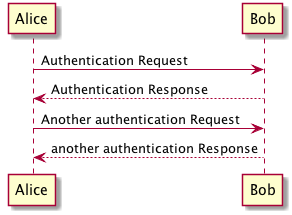

# Diagram Sample

The following is a sample PlantUML diagram.

```
@startuml diagramsample.md.static/1526475741.png
Alice -> Bob: Authentication Request
Bob --> Alice: Authentication Response

Alice -> Bob: Another authentication Request
Alice <-- Bob: another authentication Response
@enduml
```


